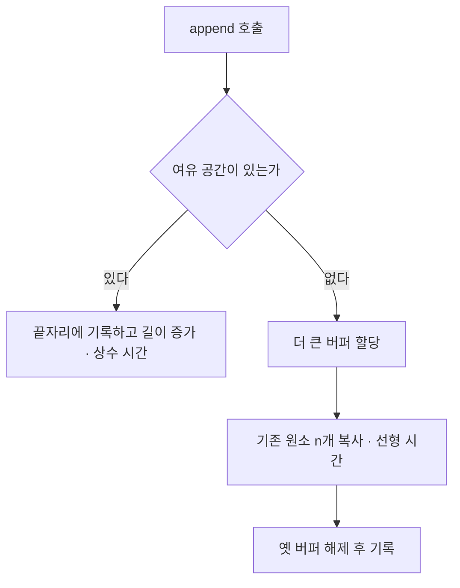
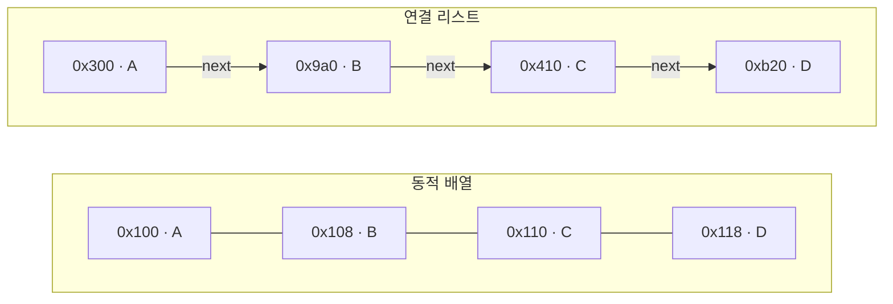
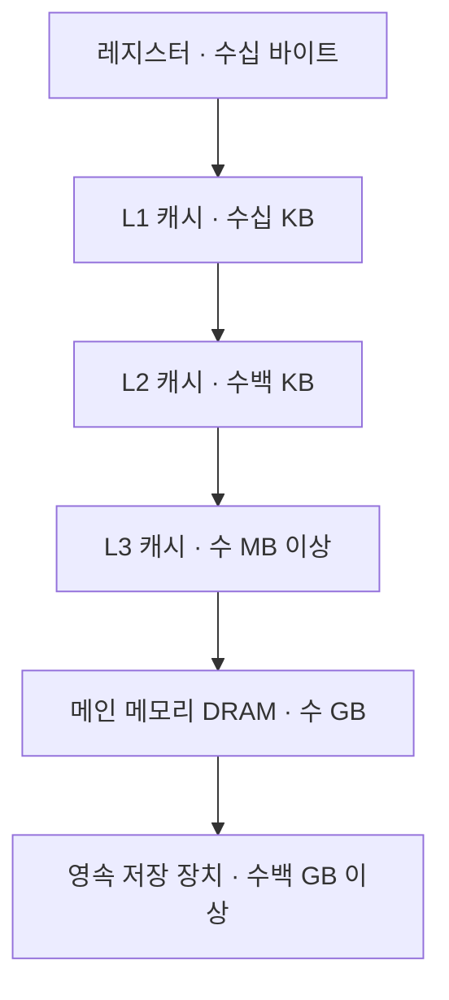

## 이 글에서 다루는 것

**요약** 이 글은 자료구조를 고르는 판단을 두 축으로 정리한다. 하나는 점근 표기와 분할 상환 분석이라는 비용을 세는 언어, 다른 하나는 캐시 라인과 참조 지역성이라는 실제 하드웨어의 비용이다. 이 둘을 같이 놓으면 "빅오가 같은데 왜 성능이 다른가"라는 질문에 근거를 갖고 답할 수 있다.

- **난이도**: 입문에서 중급. 앞의 두 절은 입문, 캐시 절은 중급이다.
- **선수 개념**: 배열 인덱싱, 포인터나 참조의 개념, 반복문의 시간 감각.
- **다루는 범위**: 자료구조와 알고리즘의 비용 분석, 그리고 그 비용이 컴퓨터구조에서 어떻게 달라지는지. 운영체제의 페이지 교체, 데이터베이스 인덱스, 객체지향 설계는 이 글의 범위가 아니다.
- **읽고 나면 할 수 있는 것**: ① 분할 상환 상수 시간과 최악 상수 시간을 구분해 말할 수 있다. ② 동적 배열과 연결 리스트의 선택 근거를 삽입 비용과 위치 탐색 비용으로 분리해 설명할 수 있다. ③ 자기가 쓰는 언어의 컨테이너가 표준에서 어떤 복잡도를 보장하는지 문서에서 직접 확인할 수 있다.

**조사와 확인 기준**: 이 글의 1차 출처는 모두 2026-09-22에 직접 열어 확인했다. 확인 대상 버전은 C++ 표준 작업 초안의 2026-09-22 시점 본문, Java SE 21 API 문서, CPython `main` 브랜치의 `Objects/listobject.c`, Python 3 공식 FAQ다. 개념 자체는 시점에 의존하지 않지만, 언어별 보장은 버전에 따라 달라지므로 확인 시점을 밝힌다. 본문에서 **확인된 사실**은 1차 출처에 적힌 내용이고, **추론**은 그로부터 내가 끌어낸 판단이다.

## 용어 정리

**요약** 이 글이 정의하는 용어는 여덟 개다. 앞의 네 개는 비용을 세는 도구와 자료구조, 뒤의 네 개는 그 비용이 실제로 지불되는 하드웨어 쪽 개념이다.

| 용어 | 영문·별칭 | 한 줄 정의 |
|---|---|---|
| 점근 표기 | asymptotic notation, 빅오 표기, big-O notation | 입력 크기가 충분히 커질 때 함수의 증가율을 상수 배수를 무시한 상한이나 하한으로 나타내는 수학 표기법 |
| 분할 상환 분석 | amortized analysis, 상환 분석 | 연산 하나의 최악 비용 대신 연속한 연산 전체의 비용을 횟수로 나눈 평균 비용을 보장하는 분석 방법 |
| 동적 배열 | dynamic array, growable array | 원소를 메모리에 연속으로 담고 자리가 차면 더 큰 공간으로 옮겨 담아 크기를 늘리는 자료구조 |
| 연결 리스트 | linked list | 각 원소가 다음 원소의 주소를 함께 저장해 메모리에 흩어진 상태로도 순서를 유지하는 자료구조 |
| 캐시 라인 | cache line, cache block | CPU 캐시와 메모리가 데이터를 주고받는 최소 단위 블록이며 한 바이트만 읽어도 블록 전체가 캐시로 올라온다 |
| 참조 지역성 | locality of reference, 시간 지역성, 공간 지역성 | 방금 접근한 데이터나 그 주변 주소가 곧 다시 쓰일 가능성이 높다는 프로그램 접근 패턴의 경향 |
| 메모리 계층 | memory hierarchy | 레지스터에서 캐시와 메인 메모리와 디스크로 갈수록 느려지고 커지는 저장 장치를 층으로 쌓아 구성하는 방식 |
| 거짓 공유 | false sharing | 서로 다른 스레드가 각자의 변수만 고쳐도 두 변수가 같은 캐시 라인에 있어 일관성 통신 때문에 느려지는 현상 |

## 점근 표기와 분할 상환 분석

**요약** 점근 표기는 기계에 따라 달라지는 상수를 버리고 증가율만 남긴 비교 언어이고, 분할 상환 분석은 비싼 연산의 비용을 앞서 있었던 싼 연산들에 나눠 붙여 평균을 보장하는 계산이다. 언어 표준은 이 보장을 기호가 아니라 constant, amortized constant time 같은 문장으로 적는다. 대신 상수 인자와 개별 호출의 최악 지연은 이 표기에서 사라진다.

### 왜 생겼는가

**요약** 실행 시간을 초로 말하면 기계와 컴파일러가 바뀔 때마다 결론이 무너진다. 점근 표기는 기계에 의존하는 상수를 의도적으로 버려서, 입력이 커질 때의 증가율만 남긴 비교 언어다.

같은 코드가 어떤 노트북에서 1.2초, 다른 서버에서 0.3초라면 두 알고리즘의 우열을 초로 논할 수 없다. 남는 질문은 하나다. 입력이 10배가 되면 비용은 몇 배가 되는가. 점근 표기는 이 질문에만 답하도록 설계된 도구다.

정의는 수학 관례를 따른다. 양의 함수 `f`, `g`에 대해 `f(n) = O(g(n))`은 어떤 상수 `c > 0`과 `n0`이 존재해 모든 `n ≥ n0`에서 `f(n) ≤ c · g(n)`이 성립한다는 뜻이다. `Ω`는 같은 방식의 하한, `Θ`는 상한과 하한이 동시에 성립하는 경우다. 이 표기의 사용법을 전산학에서 정리한 원전은 D. E. Knuth, "Big Omicron and big Omega and big Theta", ACM SIGACT News 8(2), 1976, pp. 18–24이다. 다만 이번 조사에서 해당 PDF는 접근이 거부되어 **원문은 열지 못했고 서지 정보만 확인했다**. 따라서 위 정의는 표준 문서 인용이 아니라 일반 수학 관례로 읽어야 한다.

주목할 점은 언어 표준이 이 기호를 쓰지 않는다는 것이다. **확인된 사실**로, C++ 표준은 컨테이너 요구사항 표에서 `c.size()`의 Complexity를 "Constant"라는 말로 규정하고, Java SE 21의 `ArrayList` 문서도 "run in constant time", "amortized constant time"이라는 서술로 보장을 적는다. 기호가 아니라 문장이 계약이다.

### 어떻게 동작하는가

**요약** 분할 상환 분석은 비싼 연산의 비용을 그 전에 있었던 싼 연산들에 나눠 붙이는 계산이다. 동적 배열의 append가 그 대표 예다.

동적 배열에 원소를 하나 더 넣는 연산을 보자. 자리가 남아 있으면 쓰기 한 번으로 끝나고, 자리가 없으면 더 큰 버퍼를 잡아 기존 원소 전부를 옮긴다.



핵심은 증가 폭이다. 용량을 매번 고정된 양만큼 늘리면 복사는 계속 반복되어 n번 append의 총비용이 n의 제곱에 비례한다. 반면 용량을 현재 크기에 비례해 늘리면 복사가 일어나는 간격도 같이 벌어지므로, n번 append의 총비용이 n에 비례한다. 연산 하나당 평균은 상수가 되고, 이것이 분할 상환 상수 시간이다.

**확인된 사실**: Java의 `ArrayList` 문서는 "The `add` operation runs in *amortized constant time*, that is, adding n elements requires O(n) time"이라고 적으면서, 동시에 "The details of the growth policy are not specified beyond the fact that adding an element has constant amortized time cost"라고 못 박는다. 즉 몇 배로 늘리는지는 계약이 아니다. C++ 표준도 `vector`가 "supports (amortized) constant time insert and erase operations at the end"라고만 규정한다.

구현을 보면 배율이 꼭 2배인 것도 아니다. **확인된 사실**로, CPython의 `Objects/listobject.c`의 `list_resize`는 다음 식을 쓴다.

```c
/* CPython: Objects/listobject.c 의 list_resize */
new_allocated = ((size_t)newsize + (newsize >> 3) + 6) & ~(size_t)3;
```

주석은 "This over-allocates proportional to the list size... The over-allocation is mild, but is enough to give linear-time amortized behavior over a long sequence of appends()"라고 설명하고, 그 결과 용량이 `0, 4, 8, 16, 24, 32, 40, 52, 64, 76, ...`로 자란다고 적어 놓았다. 배율은 약 1.125로 작지만 크기에 비례하므로 분할 상환 보장은 성립한다. **추론**: 배율이 작을수록 메모리 낭비는 줄고 재할당 횟수는 늘어난다. CPython은 낭비를 줄이는 쪽을 택한 것이다.

### 무엇을 얻고 무엇을 잃는가

**요약** 얻는 것은 기계에 독립적인 비교 기준이고, 잃는 것은 상수 인자와 최악 지연이다. 이 두 손실이 뒤의 두 절의 주제다.

- **얻는 것**: 알고리즘을 기계·언어·컴파일러와 분리해 비교할 수 있다. 입력이 커질 때의 확장성을 미리 판단할 수 있다.
- **잃는 것 1 — 상수 인자**: `O(n)`과 `O(n)`의 차이가 실제로 10배일 수 있다. Java 문서가 `ArrayList`에 대해 "The constant factor is low compared to that for the `LinkedList` implementation"이라고 굳이 적어 둔 이유가 여기 있다. 복잡도 등급이 같아도 상수가 다르다는 사실을 표준 문서 스스로 인정하는 것이다.
- **잃는 것 2 — 최악 지연**: 분할 상환은 평균의 보장이지 개별 호출의 보장이 아니다. Python 위키의 복잡도 표는 append를 "O(1) amortized worst case"로 적으면서 "Individual actions may take surprisingly long, depending on the history of the container"라고 경고한다. 이 표는 CPython 기준의 커뮤니티 문서이고 언어 명세가 아니므로, 계약이 아니라 구현 특성으로 읽어야 한다.
- **잃는 것 3 — 비용 모델의 단순화**: 점근 분석은 보통 모든 메모리 접근을 같은 상수 시간으로 가정한다. 실제 하드웨어는 그렇지 않다.

## 동적 배열과 연결 리스트

**요약** 두 자료구조는 같은 순서를 표현하면서 대가를 반대로 나눠 가졌다. 배열은 연속 저장으로 임의 접근을 얻고 중간 수정을 잃었고, 연결 리스트는 국소 수정과 참조 안정성을 얻고 임의 접근을 잃었다. 표준 문서가 보장하는 상수 시간 삽입은 삽입 지점을 이미 쥐고 있을 때의 비용이므로, 위치를 찾는 순회를 따로 세야 실제 비용이 나온다.

### 왜 생겼는가

**요약** 배열은 위치 계산이 공짜인 대신 중간을 비집고 들어가려면 원소를 밀어야 한다. 연결 리스트는 밀지 않는 대신 위치를 계산할 방법이 없다. 두 자료구조는 같은 순서를 표현하면서 이 대가를 반대로 나눠 가진 설계다.

**확인된 사실**: C++ 표준은 배열을 "An object of type array of N U consists of a contiguously allocated non-empty set of N subobjects of type U"로 정의한다. 연속이라는 성질 하나로 `i`번째 원소의 주소가 시작 주소 더하기 `i` 곱하기 원소 크기라는 산술로 끝나고, 임의 접근이 상수 시간이 된다. 대신 크기를 미리 정해야 하므로, 여기에 앞 절의 재할당 전략을 붙인 것이 동적 배열이다.

연결 리스트는 반대 선택이다. 원소마다 다음 원소의 주소를 들고 있으면 메모리가 흩어져 있어도 순서를 유지할 수 있고, 노드를 이미 손에 쥐고 있다면 그 자리에 끼워 넣는 일이 주변 포인터 몇 개를 고치는 작업으로 끝난다.



### 어떻게 동작하는가

**요약** 표준 문서가 보장하는 비용은 언어마다 문언이 다르다. 결정적인 차이는 "삽입 비용"과 "삽입 위치를 찾는 비용"을 누가 어떻게 계산에 넣는가다.

**확인된 사실 — C++ 표준 작업 초안**

- `vector`는 연속 컨테이너이고, 끝에서의 삽입·삭제가 분할 상환 상수 시간이다. 중간 삽입은 재할당이 일어나면 결과 벡터의 원소 수에 선형, 아니면 삽입 개수 더하기 끝까지의 거리에 선형이다.
- `list`는 "a sequence container that supports bidirectional iterators and allows constant time insert and erase operations anywhere within the sequence"이고, "Unlike vectors and deques, fast random access to list elements is not supported"라고 명시한다. `operator[]`와 `at`이 아예 없다.
- 컨테이너 요구사항 표는 `c.size()`의 Complexity를 "Constant"로 규정한다. **추론**: 그래서 `std::list`도 길이를 따로 저장해야 하며, 노드를 세어 길이를 구하는 구현은 표준을 만족하지 못한다.

여기서 중요한 함정이 보인다. C++의 `list`가 말하는 상수 시간 삽입은 **삽입 지점을 가리키는 이터레이터를 이미 갖고 있을 때**의 비용이다. 위치를 찾는 비용은 그 보장에 포함되지 않는다.

```cpp
// C++
std::list<int> xs{1, 2, 3, 4};
auto it = std::find(xs.begin(), xs.end(), 3); // 위치 탐색: 선형
xs.insert(it, 99);                            // 삽입 자체: 상수
```

**확인된 사실 — Java SE 21**

- `ArrayList`: "The `size`, `isEmpty`, `get`, `set`, `iterator`, and `listIterator` operations run in constant time. The `add` operation runs in *amortized constant time*... All of the other operations run in linear time." 미리 용량을 늘리는 `ensureCapacity`가 "may reduce the amount of incremental reallocation"이라고 안내된다.
- `LinkedList`: "All of the operations perform as could be expected for a doubly-linked list. Operations that index into the list will traverse the list from the beginning or the end, whichever is closer to the specified index." **추론**: 그래서 `get(i)`는 최악 `n/2` 단계이며, 인덱스 기반 반복문으로 `LinkedList`를 훑으면 전체가 n의 제곱에 비례한다. 순회는 반드시 이터레이터로 해야 한다.

**확인된 사실 — Python 3 / CPython**

- 공식 FAQ는 "CPython's lists are really variable-length arrays, not Lisp-style linked lists"라고 밝히고, "a contiguous array of references to other objects"를 쓰며 "indexing a list `a[i]`... cost is independent of the size of the list or the value of the index"라고 설명한다. 이름이 `list`지만 연결 리스트가 아니다.
- Python 위키의 복잡도 표는 CPython 기준으로 인덱싱 O(1), append 분할 상환 O(1), `insert` O(n), 끝에서의 `pop` O(1), 중간 `pop(k)` O(n)을 적는다. 앞서 말했듯 이는 구현 특성이다.

**추론이 필요한 지점**: Python의 리스트는 연속 배열이지만 그 안에 들어 있는 것은 객체 참조다. 따라서 배열 자체는 연속이어도 원소 값들은 힙에 흩어져 있을 수 있다. 다음 절의 지역성 논의가 C++ `std::vector<int>`와 Python 리스트에 똑같이 적용되지 않는 이유가 이것이다.

### 무엇을 얻고 무엇을 잃는가

**요약** 대부분의 워크로드에서 기본값은 동적 배열이다. 연결 리스트는 "이미 손에 쥔 노드를 자주 떼고 붙이는" 문제, 그리고 포인터·이터레이터가 무효화되면 안 되는 문제에서 제값을 한다.

| 기준 | 동적 배열 | 연결 리스트 |
|---|---|---|
| 인덱스 접근 | 상수 시간 | 지원하지 않거나 선형 |
| 끝에 추가 | 분할 상환 상수 시간 | 상수 시간 |
| 중간 삽입·삭제 | 선형, 원소 이동 필요 | 위치를 이미 알면 상수 시간 |
| 원소당 추가 메모리 | 미사용 여유 용량 | 노드마다 포인터 한두 개와 할당 헤더 |
| 최악 지연 | 재할당 시 선형 지연이 튄다 | 재할당 없음 |
| 참조 안정성 | 재할당 시 포인터·이터레이터 무효화 | 다른 원소의 위치가 유지된다 |

- **얻는 것**: 배열은 임의 접근과 낮은 상수 인자, 그리고 메모리 연속성을 얻는다. 연결 리스트는 대량 이동 없는 국소 수정과 예측 가능한 지연, 참조 안정성을 얻는다.
- **잃는 것**: 배열은 최악 지연이 튀고 중간 수정이 비싸다. 연결 리스트는 노드마다 포인터와 별도 할당이 붙어 메모리를 더 쓰고, 위치를 찾는 순회가 거의 모든 실제 작업의 앞단에 붙는다.

## 캐시 라인과 참조 지역성

**요약** 메모리는 바이트가 아니라 캐시 라인 단위로 오간다. 그래서 복잡도가 같아도 연속 순회와 포인터 추적의 실제 비용이 갈리고, 이것이 앞 절에서 점근 표기가 버린 상수 인자의 정체다. 다만 라인 크기는 구현마다 다르므로 이 글은 특정 바이트 수를 단정하지 않고, C++이 제공하는 간섭 크기 상수를 이식성 있는 대안으로 제시한다.

### 왜 생겼는가

**요약** CPU는 메모리보다 훨씬 빠르다. 이 격차를 메우기 위해 작고 빠른 저장 계층을 여러 층 두고, 데이터를 바이트 단위가 아니라 블록 단위로 옮긴다. 이 블록이 캐시 라인이고, 블록 단위 이동이 이득이 되는 근거가 참조 지역성이다.



위로 갈수록 빠르고 작으며, 아래로 갈수록 느리고 크다. 프로그램이 방금 쓴 데이터를 곧 다시 쓰는 경향을 시간 지역성, 방금 쓴 주소의 이웃을 쓰는 경향을 공간 지역성이라고 한다. **확인된 사실**로, temporal locality라는 용어는 구현 문서만의 표현이 아니라 C++ 표준 본문에도 등장한다. 표준은 `hardware_constructive_interference_size`를 "the maximum recommended size of contiguous memory occupied by two objects accessed with temporal locality by concurrent threads"로 정의한다.

### 어떻게 동작하는가

**요약** 메모리 읽기는 라인 단위로 이루어진다. 따라서 연속 배열을 순서대로 훑으면 한 번의 메모리 왕복으로 여러 원소를 얻고, 흩어진 노드를 따라가면 원소마다 왕복이 필요할 수 있다.

라인 크기에 대해 이번 조사에서 확인한 범위를 분명히 해 둔다.

- **확인된 사실**: Intel의 공식 최적화 가이드 문서는 Xe-LP 그래픽 아키텍처에 대해 "inefficient partial writes over the Xe-LP 64-byte cache lines"라고 적어 64바이트 라인을 명시한다. 이는 해당 그래픽 아키텍처 기준의 서술이다.
- **확인하지 못함**: x86-64 CPU의 라인 크기를 규정하는 Intel 64 and IA-32 Architectures Software Developer's Manual 본문은 PDF 용량 제한으로 이번에 열지 못했다. Arm 공식 캐시 문서 역시 본문을 받아오지 못했다. 따라서 "모든 x86-64 CPU의 캐시 라인은 64바이트"라는 문장은 이 글에서 1차 출처로 뒷받침하지 않는다.
- **이식성 있는 접근법**: C++17 이후 표준은 `std::hardware_destructive_interference_size`와 `std::hardware_constructive_interference_size`를 제공한다. 전자는 "the minimum recommended offset between two concurrently-accessed objects to avoid additional performance degradation due to contention", 후자는 위에 인용한 정의다. 두 값은 구현 정의이며 최소한 `alignof(max_align_t)` 이상이다. **추론**: 하드코딩한 64 대신 이 상수를 쓰는 편이 이식성 면에서 안전하다. Java와 Python에는 이에 대응하는 표준 공개 API가 있는지 이번에 확인하지 못했다.

접근 순서가 왜 문제인지는 2차원 배열에서 가장 잘 드러난다. **확인된 사실**로 C++ 표준은 배열이 연속으로 할당된다고 정의하고, 인접한 `array of` 지정이 다차원 배열을 만들며 각 첨자 연산이 남은 차원의 크기를 단위로 한 포인터 연산이라고 규정한다. **추론**: 그러므로 C와 C++의 2차원 배열은 마지막 첨자가 메모리에서 가장 인접하다. 안쪽 반복이 마지막 첨자를 돌아야 한 라인을 다 쓰고 다음 라인으로 넘어간다.

```c
/* C: 마지막 첨자가 메모리상 인접하므로 안쪽 루프를 j 로 두면 라인을 끝까지 쓴다 */
for (int i = 0; i < N; i++)
    for (int j = 0; j < N; j++)
        sum += a[i][j];
```

두 반복문의 복잡도는 둘 다 `O(N^2)`로 같다. 달라지는 것은 점근 표기가 세지 않는 메모리 왕복 횟수다.

### 무엇을 얻고 무엇을 잃는가

**요약** 얻는 것은 "복잡도가 같은데 왜 다른가"에 대한 설명력이고, 잃는 것은 이식성과 예측 가능성이다. 지역성을 노린 최적화는 하드웨어에 대한 가정을 코드에 심는다.

- **얻는 것**: 자료구조 선택을 복잡도 등급 하나로만 하지 않게 된다. 연속 레이아웃이 왜 기본값이 되는지, 왜 노드 기반 구조가 문서상 유리한 복잡도에도 밀리는 경우가 있는지 설명할 수 있다.
- **잃는 것 1 — 이식성**: 라인 크기와 캐시 용량은 구현마다 다르다. 특정 숫자에 맞춘 구조체 패딩은 다른 칩에서 이득이 사라지거나 메모리만 낭비할 수 있다.
- **잃는 것 2 — 검증 비용**: 지역성 개선은 소스만 읽어서는 판단하기 어렵다. 측정 없이 주장하면 근거 없는 믿음일 뿐이다. **추론**: 이 영역의 결론은 반드시 같은 입력, 같은 기계에서의 실측으로 확인해야 한다.
- **잃는 것 3 — 추상화 훼손**: 구조체 배열을 필드별 배열로 쪼개는 식의 레이아웃 최적화는 도메인 모델의 표현력을 희생한다. 성능이 실제 병목일 때만 지불할 값이다.

## 흔한 오해

**요약** 네 가지 오해는 모두 같은 뿌리를 갖는다. 복잡도 표기가 계약하는 범위를 실제보다 넓게 읽는 것이다.

**오해 1 — 빅오가 낮으면 항상 빠르다**

- 흔한 설명: `O(log n)`이 `O(n)`보다 항상 빠르다.
- 실제: 점근 표기는 상수 인자를 의도적으로 버린 값이고, 보장은 n이 충분히 클 때만 성립한다. 작은 n에서는 역전이 흔하며, 메모리 접근 패턴이 나쁜 `O(log n)` 구조가 캐시 친화적인 선형 순회에 밀릴 수 있다. Java 문서가 `ArrayList`의 상수 인자가 `LinkedList`보다 낮다고 명시한 것도 같은 맥락이다.
- 왜 갈리는가: 정의에 있는 `n ≥ n0`이라는 조건과 상수 `c`를 잊기 때문이다. 표기는 확장성의 언어이고, 특정 입력에서의 속도 예측 도구가 아니다.

**오해 2 — 중간 삽입이 많으면 연결 리스트가 답이다**

- 흔한 설명: 삽입·삭제가 `O(1)`이니 수정이 잦으면 연결 리스트다.
- 실제: 그 `O(1)`은 삽입 지점을 이미 가리키고 있을 때의 비용이다. C++ `std::list`는 임의 접근을 지원하지 않고 `operator[]`조차 없으며, Java `LinkedList`는 인덱스 접근 때마다 가까운 끝에서 순회한다. 위치 탐색이 앞에 붙는 순간 전체는 선형이 된다.
- 왜 갈리는가: 표준 문서의 복잡도는 연산 하나의 비용이고, 실제 작업은 탐색과 수정의 합이다. 둘을 분리해 세야 한다.

**오해 3 — 분할 상환 상수 시간이면 모든 호출이 빠르다**

- 흔한 설명: append는 `O(1)`이니 지연이 균일하다.
- 실제: 평균의 보장일 뿐이다. 재할당이 걸린 호출은 전체 복사를 수행해 선형 시간이 걸린다. Python 위키 문서도 개별 연산이 컨테이너 이력에 따라 예상보다 오래 걸릴 수 있다고 적는다.
- 왜 갈리는가: 분할 상환은 총비용에 대한 보장이고, 지연 분포에 대한 보장이 아니다. 지연에 민감한 코드라면 크기를 알 때 `reserve`나 `ensureCapacity`로 재할당을 앞당겨 치워야 한다.

**오해 4 — Python의 list는 연결 리스트다**

- 흔한 설명: 이름이 `list`이고 크기가 자유롭게 늘어나니 연결 리스트일 것이다.
- 실제: 공식 FAQ가 직접 부정한다. CPython의 리스트는 객체 참조를 담은 연속 배열이며, 인덱싱 비용이 크기나 인덱스 값과 무관하다. 앞에서 인용한 `list_resize`의 초과 할당이 그 구현이다.
- 왜 갈리는가: 이름이 Lisp 계열의 list를 연상시키기 때문이다. 자료구조를 이름이 아니라 그 언어의 구현·문서로 확인해야 한다.

## 면접에서 자주 묻는 것

**요약** 이 주제에서 묻는 질문은 사실 하나다. 복잡도 표기가 무엇을 보장하고 무엇을 보장하지 않는지 아는가.

1. **배열과 연결 리스트의 차이, 그리고 선택 기준은 무엇인가**
   배열은 연속 저장이라 인덱스 접근이 상수 시간이고 중간 수정이 선형이다. 연결 리스트는 노드를 이미 알 때의 국소 수정이 상수 시간이고 임의 접근이 없다. 기본값은 동적 배열로 두고, 대량 이동 없이 떼고 붙이는 작업이 지배적이거나 다른 원소를 가리키는 참조가 무효화되면 안 될 때 연결 리스트를 택한다.

2. **동적 배열의 append는 왜 분할 상환 상수 시간인가**
   용량을 현재 크기에 비례해 늘리면 재할당 간격이 기하적으로 벌어져, n번 추가의 총 복사량이 n에 비례한다. 따라서 호출당 평균은 상수다. 단 재할당이 걸린 개별 호출은 선형이다. Java는 증가 정책을 명세하지 않고 분할 상환 상수만 보장하며, CPython은 크기의 약 8분의 1을 더하는 완만한 초과 할당을 쓴다.

3. **복잡도가 같은데 실제 성능이 다른 이유는 무엇인가**
   점근 표기는 상수 인자를 버리고, 모든 메모리 접근을 같은 비용으로 가정한다. 실제로는 캐시 라인 단위 전송과 지역성 때문에 연속 순회와 포인터 추적의 비용이 크게 벌어진다. 원소당 할당 오버헤드와 분기 예측도 상수 인자에 들어간다.

4. **시간 지역성과 공간 지역성은 무엇이고 코드에서 어떻게 살리는가**
   방금 쓴 데이터를 다시 쓰는 경향이 시간 지역성, 그 이웃 주소를 쓰는 경향이 공간 지역성이다. 다차원 배열을 메모리 인접 방향으로 순회하고, 함께 쓰는 필드를 같은 구조체에 모으고, 자료구조를 연속 버퍼로 두면 살아난다.

5. **C++에서 `std::list::size`는 왜 상수 시간이어야 하는가**
   표준의 컨테이너 요구사항 표가 `size`의 복잡도를 상수로 규정하기 때문이다. 그래서 구현은 원소 수를 따로 관리한다. 이는 "표준이 무엇을 계약하는지 문서에서 확인하는 습관"을 보려는 질문이기도 하다.

## 개발자가 알아둘 것

**요약** 실무의 규칙은 셋으로 줄어든다. 기본은 연속 배열, 크기를 알면 미리 예약, 그리고 지역성 관련 주장은 측정으로만 확정한다.

- **기본 자료구조는 동적 배열로 둔다**: `std::vector`, `ArrayList`, Python 리스트가 해당한다. 연결 리스트로 바꾸는 결정은 "노드를 이미 쥔 상태의 국소 수정이 지배적"이라는 근거가 있을 때만 한다.
- **크기를 알면 미리 확보한다**: `ensureCapacity`나 `reserve`로 재할당을 없애면 분할 상환 뒤에 숨은 지연 스파이크가 사라진다. 지연 분포가 중요한 서비스에서는 평균 복잡도보다 이 편이 중요하다.
- **참조 무효화를 계약으로 본다**: 동적 배열은 재할당 시 기존 포인터와 이터레이터가 무효가 된다. 원소 주소를 들고 다니는 코드는 컨테이너 종류를 바꿀 때 같이 검토해야 한다.
- **인덱스 순회와 이터레이터 순회를 구분한다**: Java `LinkedList`를 인덱스로 훑는 코드는 조용히 n의 제곱이 된다. 컨테이너 문서가 인덱스 연산을 어떻게 설명하는지 확인하는 것으로 예방된다.
- **런타임이 값을 어떻게 담는지 확인한다**: C++의 `std::vector<int>`는 정수 값 자체가 연속이지만, CPython 리스트는 참조가 연속이고 값은 흩어질 수 있다. 수치 계산에서 연속 버퍼가 필요하면 참조 배열이 아닌 전용 배열 타입을 쓴다.
- **동시성에서는 레이아웃이 정확성이 아니라 성능을 흔든다**: 스레드마다 다른 카운터를 고치는데도 느리면 거짓 공유를 의심한다. C++에서는 `std::hardware_destructive_interference_size`만큼 떨어뜨리는 것이 이식성 있는 대응이다. 하드코딩한 바이트 수는 다른 칩에서 이득이 사라진다.
- **복잡도는 문서에서 확인한다**: 같은 이름의 컨테이너라도 언어와 버전에 따라 보장이 다르다. 표준 문서나 공식 API 문서의 Complexity 문장이 유일한 계약이며, 블로그 요약은 근거가 아니다.

## 더 읽을 거리

**요약** 아래 자료는 모두 2026-09-22에 직접 열어 확인했다. 열지 못한 것은 그대로 표시했다.

**직접 확인한 1차 출처**

- C++ 표준 작업 초안, 시퀀스 컨테이너 `vector` — 연속 컨테이너 요구사항과 끝에서의 분할 상환 상수 시간 삽입: <https://eel.is/c++draft/vector> (확인일 2026-09-22)
- C++ 표준 작업 초안, 시퀀스 컨테이너 `list` — 임의 위치 상수 시간 삽입·삭제, 임의 접근 미지원: <https://eel.is/c++draft/list> (확인일 2026-09-22)
- C++ 표준 작업 초안, 컨테이너 요구사항 — `size`와 `begin`·`end`의 상수 복잡도: <https://eel.is/c++draft/container.reqmts> (확인일 2026-09-22)
- C++ 표준 작업 초안, 배열 선언 — 연속 할당과 다차원 배열의 첨자 계산: <https://eel.is/c++draft/dcl.array> (확인일 2026-09-22)
- C++ 표준 작업 초안, 하드웨어 간섭 크기 — `hardware_destructive_interference_size`와 `hardware_constructive_interference_size`의 정의: <https://eel.is/c++draft/hardware.interference> (확인일 2026-09-22)
- Java SE 21 API 문서, `java.util.ArrayList` — 상수 시간 연산과 분할 상환 상수 시간 `add`, 증가 정책 비명세: <https://docs.oracle.com/en/java/javase/21/docs/api/java.base/java/util/ArrayList.html> (확인일 2026-09-22)
- Java SE 21 API 문서, `java.util.LinkedList` — 이중 연결 리스트와 가까운 끝에서의 순회: <https://docs.oracle.com/en/java/javase/21/docs/api/java.base/java/util/LinkedList.html> (확인일 2026-09-22)
- Python 3 공식 문서, Design and History FAQ — CPython 리스트는 가변 길이 배열이며 참조의 연속 배열이라는 설명: <https://docs.python.org/3/faq/design.html> (확인일 2026-09-22)
- CPython 소스, `Objects/listobject.c` — `list_resize`의 초과 할당 식과 증가 패턴 주석: <https://github.com/python/cpython/blob/main/Objects/listobject.c> (`main` 브랜치, 확인일 2026-09-22)
- Intel 공식 최적화 가이드, Intel Processor Graphics Xe-LP API Developer and Optimization Guide — 64바이트 캐시 라인에 걸친 부분 쓰기 경고: <https://www.intel.com/content/www/us/en/developer/articles/guide/lp-api-developer-optimization-guide.html> (확인일 2026-09-22)

**참고 수준의 자료와 확인 한계**

- Python 위키, TimeComplexity — CPython 기준 연산별 복잡도표. 언어 명세가 아니라 커뮤니티 문서다: <https://wiki.python.org/moin/TimeComplexity> (확인일 2026-09-22)
- D. E. Knuth, "Big Omicron and big Omega and big Theta", ACM SIGACT News 8(2), 1976, pp. 18–24 — 점근 표기 사용법의 원전. 이번 조사에서 PDF 접근이 거부되어 **원문은 확인하지 못했고 서지 정보만 확인했다**: <https://dl.acm.org/doi/10.1145/1008328.1008329>
- Intel 64 and IA-32 Architectures Software Developer's Manual 및 Optimization Reference Manual — CPU 캐시 라인 크기와 프리페처 동작의 1차 출처지만, PDF 용량 제한으로 이번에 **본문을 열지 못했다**. 그래서 x86-64 CPU 라인 크기를 이 글에서 단정하지 않았다: <https://www.intel.com/content/www/us/en/developer/articles/technical/intel-sdm.html>
- Arm 공식 캐시 문서 — 캐시 라인과 지역성 서술을 확인하려 했으나 문서 페이지 본문을 받아오지 못했다. Arm 기준의 라인 크기와 `CTR_EL0` 관련 서술은 **확인하지 못함**으로 남긴다.
