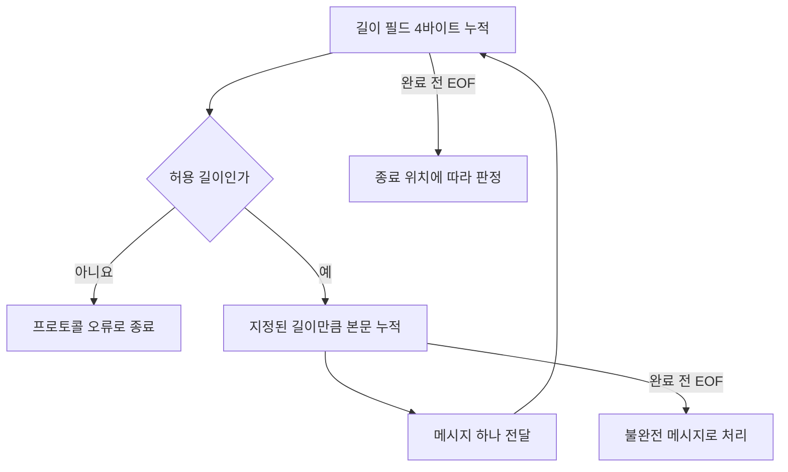

## 이 글에서 다루는 것

**요약** TCP는 바이트의 순서를 보장하지만 애플리케이션 메시지의 경계를 정해 주지는 않는다. 올바른 통신 코드를 만들려면 메시지를 나누는 규칙과 느린 수신자에 맞춰 생산을 제한하는 규칙이 함께 필요하다.

- **난이도:** 입문에서 중급.
- **선수 개념:** 바이트와 문자열의 차이, 함수 호출, 반복문, 클라이언트와 서버의 역할.
- **범위:** TCP 바이트 스트림, 메시지 프레이밍, 흐름 제어와 애플리케이션 역압의 관계.
- **읽고 나면 할 수 있는 것:** 수신 함수 한 번으로 메시지 하나를 읽을 수 없는 이유를 설명하고, 길이 기반 수신기를 설계하며, 버퍼 증가가 발생하는 위치를 구분할 수 있다.
- **조사일:** 2026-09-29.
- **조사 기간:** 2026-09-29 당일. 최근 사건이 아니라 기존 명세와 공식 문서의 정의·동작을 확인했다.

본문의 **확인된 사실**은 직접 연 1차 출처에 근거한다. **설계 판단**과 **가정 예시**는 그 사실을 적용한 설명이다. API 동작은 Python(파이썬) 3 공식 문서 기준이며, 운영체제별 버퍼 기본값과 성능은 다루지 않는다. 예제 실행과 문서 자동 검사 결과는 이 글의 검증 범위에 포함하지 않았다.

## 용어 정리

**요약** 바이트 전달, 메시지 해석, 생산 속도 제한은 서로 다른 책임이다. 아래 용어를 구분하면 통신 장애가 어느 책임에서 발생했는지 좁힐 수 있다.

| 용어 | 영문·별칭 | 한 줄 정의 |
|---|---|---|
| TCP | Transmission Control Protocol | TCP는 연결된 두 종단 사이에 신뢰성 있는 순서 보장 바이트 스트림을 제공하는 전송 계층 프로토콜이다. |
| 바이트 스트림 | byte stream | 바이트 스트림은 메시지 경계를 자체적으로 표현하지 않는 순서 있는 바이트의 연속이다. |
| 메시지 프레이밍 | message framing | 메시지 프레이밍은 바이트의 연속에서 개별 메시지의 시작과 끝을 식별하는 규칙이다. |
| 수신 윈도 | receive window, rwnd | TCP 수신 윈도는 수신 측이 받아들일 수 있다고 송신 측에 알리는 바이트 범위다. |
| 흐름 제어 | flow control | 흐름 제어는 수신 측의 수용 능력에 맞춰 송신 측의 데이터 전송을 제한하는 기법이다. |
| 역압 | backpressure | 역압은 소비 측의 처리 여유 부족을 생산 측에 전달해 추가 생산이나 전달을 늦추는 방식이다. |

TCP와 수신 윈도의 정의는 [RFC 9293](https://www.rfc-editor.org/rfc/rfc9293.html), 프레이밍은 [Python Socket Programming HOWTO](https://docs.python.org/3/howto/sockets.html), 역압의 구체적인 API 사례는 [Python asyncio Streams](https://docs.python.org/3/library/asyncio-stream.html)에 근거한다.

## TCP 바이트 스트림: 순서와 경계는 다르다

**요약** TCP에서 애플리케이션이 관찰하는 단위는 순서 있는 바이트다. 송신 함수 호출 횟수와 수신 함수 호출 횟수 사이에는 일대일 대응이 없다.

**왜 생겼는가**

네트워크를 지나는 데이터에는 손실과 순서 뒤바뀜이 생길 수 있다. 애플리케이션마다 이를 복구하는 부담을 줄이기 위해 TCP는 순서 번호와 재전송 등을 사용한다. **확인된 사실:** RFC 9293은 TCP 서비스를 신뢰성 있는 순서 보장 바이트 스트림으로 정의한다. [RFC 9293, 2.2](https://www.rfc-editor.org/rfc/rfc9293.html#section-2.2)

**어떻게 동작하는가**

**가정 예시:** 송신자가 `ABC`와 `DEF`를 차례로 보냈다고 하자. 수신자는 한 번에 `ABCDEF`를 읽을 수도 있고, 처음에는 `AB`만 읽은 뒤 나머지를 읽을 수도 있다. 분할 방식이 달라도 이어 붙인 바이트 순서는 같다. 송신 호출의 경계를 복원할 정보는 별도로 넣지 않았다.

Python의 TCP 소켓에서 `recv(4096)`은 **최대 4096바이트**를 읽는 호출이다. 정확히 그만큼 채우거나 메시지 하나를 완성할 때까지 기다린다는 뜻이 아니다. `send()` 역시 일부 바이트만 보낼 수 있어 반환값을 확인해야 한다. [Python socket API](https://docs.python.org/3/library/socket.html#socket.socket.recv)

**무엇을 얻고 무엇을 잃는가**

애플리케이션은 개별 전송 조각의 손실 복구를 직접 구현하지 않아도 된다. 대신 메시지 경계는 직접 정의해야 한다. 또한 TCP의 신뢰성은 연결이 언제나 성공하거나 상대 업무 처리가 끝난다는 보장이 아니다. [RFC 9293, 2.2 및 3.9.1](https://www.rfc-editor.org/rfc/rfc9293.html#section-3.9.1)

**설계 판단:** 주문 요청을 보낸 뒤 필요한 것은 단순한 송신 성공이 아니라 주문 결과를 나타내는 응답이다. 응답을 받지 못했다면 업무가 실행됐는지 판단할 별도 절차가 필요하다.

## 메시지 프레이밍: 바이트에서 메시지를 복원한다

**요약** 프레이밍은 수신 호출의 결과를 메시지로 착각하지 않도록 만드는 약속이다. 길이 기반 방식에서도 길이 필드 자체가 나뉘어 도착할 수 있으므로 단계별 누적 수신이 필요하다.

**왜 생겼는가**

한 연결에서 여러 요청을 주고받으려면 첫 요청이 어디서 끝나는지 알아야 한다. Python 공식 HOWTO는 고정 길이, 구분자, 길이 표시, 연결 종료를 메시지 완료 판단 방법으로 설명한다. [Python Socket Programming HOWTO](https://docs.python.org/3/howto/sockets.html#using-a-socket)

**어떻게 동작하는가**

**가정 예시:** 메시지마다 앞의 4바이트에 본문 길이를 부호 없는 정수로 기록하고, 큰 바이트부터 전송하기로 정하자. 이 글의 예시 프로토콜이며 TCP가 정한 형식은 아니다.

수신기는 먼저 길이 필드를 완성하고, 허용 범위를 검사한 다음, 해당 길이만큼 본문을 읽는다. 다음 메시지에도 같은 규칙을 반복한다.



Python의 **블로킹 TCP 소켓**을 전제로 한 핵심 수신 코드는 다음과 같다.

```python
def read_exact(sock, size):
    data = bytearray()
    while len(data) < size:
        chunk = sock.recv(size - len(data))
        if not chunk:
            raise EOFError("필요한 바이트를 받기 전에 종료됨")
        data.extend(chunk)
    return bytes(data)

def read_message(sock):
    size = int.from_bytes(read_exact(sock, 4), "big")
    if size > 1024 * 1024:
        raise ValueError("메시지 크기 제한 초과")
    return read_exact(sock, size)
```

이 예시는 본문 최대 크기를 **1 MiB로 선택**했다. 표준 권장값이 아니다. 길이 0인 메시지는 허용한다. 실제 서비스에서는 다음 메시지의 첫 바이트를 받기 전 정상 종료와, 헤더·본문 중간 종료를 구분해야 한다. 이 코드는 간결함을 위해 모두 `EOFError`로 알린다.

**확인된 사실:** Python TCP 소켓에서 양수 크기로 호출한 `recv()`가 빈 바이트열을 반환하면 수신 방향의 종료를 의미한다. 단순히 지금 받을 데이터가 없다는 뜻이 아니다. [Python socket API](https://docs.python.org/3/library/socket.html#socket.socket.recv)

**무엇을 얻고 무엇을 잃는가**

다음 표는 프레이밍 방식에 대한 **설계 판단**이다.

| 방식 | 얻는 것 | 부담과 제약 |
|---|---|---|
| 고정 길이 | 경계 계산이 단순하다 | 가변 크기 데이터에 낭비나 별도 분할 규칙이 생긴다 |
| 구분자 | 사람이 읽는 프로토콜에 적합하다 | 본문에 구분자가 들어갈 때의 표현 규칙이 필요하다 |
| 길이 표시 | 임의의 이진 데이터를 구분할 수 있다 | 길이 검증과 불완전 수신 처리가 필요하다 |
| 연결 종료 | 끝을 표시하는 별도 필드가 줄어든다 | 같은 방향으로 다음 메시지를 이어 보낼 수 없다 |

실제 HTTP/1.1도 프레이밍 규칙을 가진다. 다만 `Content-Length`만 읽으면 충분하지 않다. 응답 종류와 `Transfer-Encoding` 등에 따른 우선순위가 있으며, 선언된 길이보다 일찍 종료된 본문은 불완전하다. [RFC 9112, 6.3](https://www.rfc-editor.org/rfc/rfc9112.html#section-6.3)

**설계 판단:** HTTP처럼 이미 정해진 프로토콜은 검증된 구현을 사용하고, 자체 프로토콜에서는 최대 메시지 크기와 프레임 전체 수신 제한 시간을 함께 정하는 편이 좋다.

## 흐름 제어와 역압: 느린 소비자의 부담을 되돌린다

**요약** TCP 흐름 제어는 수신 측의 수용 한도를 반영하지만, 애플리케이션 내부 작업 대기열까지 자동으로 제한하지는 않는다. 메모리를 제한하려면 생산자까지 이어지는 역압이 필요하다.

**왜 생겼는가**

**가정 예시:** 네트워크에서 초당 1,000개의 요청을 읽지만 업무 처리는 초당 100개만 가능하다고 하자. 읽은 요청을 제한 없는 대기열로 옮기면, 처리 전 요청이 초당 약 900개씩 늘어난다. 네트워크 수신이 원활하다는 사실만으로 서비스가 감당하고 있다고 판단할 수 없다.

**어떻게 동작하는가**

**확인된 사실:** TCP 수신자는 수신 윈도로 받아들일 수 있는 범위를 알린다. 윈도가 0이면 일반적인 새 데이터 전송이 제한되지만, 윈도가 다시 열렸는지 확인하는 탐사는 계속된다. 윈도 0은 연결 종료와 다르다. [RFC 9293, 3.8.6.1](https://www.rfc-editor.org/rfc/rfc9293.html#section-3.8.6.1)

Python `asyncio`에도 쓰기 버퍼와 연결된 제어 지점이 있다. `StreamWriter.write()` 뒤에 `await writer.drain()`을 호출하면 버퍼가 상한에 도달한 경우 하한까지 줄어들기를 기다린다. 기다릴 필요가 없으면 즉시 반환한다. 이는 상대 업무 완료를 기다리는 API가 아니다. [Python asyncio Streams](https://docs.python.org/3/library/asyncio-stream.html#asyncio.StreamWriter.drain)

**설계 판단:** 수신 후 업무 처리를 분리한다면 다음처럼 대기열 포화가 수신 중단으로 이어지게 설계할 수 있다.


각 단계에 이미 남은 여유 공간이 있으므로 제한이 즉시 끝까지 전달되지는 않는다. 중간에 제한 없는 대기열을 두면 그곳이 계속 데이터를 받아 역압 전달을 끊을 수 있다.

**무엇을 얻고 무엇을 잃는가**

**설계 판단:** 버퍼 한도는 메모리 사용을 예측하기 쉽게 만든다. 대신 과부하 상황에서는 생산자를 기다리게 하거나 요청을 거절해야 한다. 대기열을 크게 하면 짧은 폭증을 흡수하지만 대기 시간이 늘고, 작게 하면 과부하가 빨리 드러나지만 순간적인 요청도 거절할 수 있다.

따라서 크기뿐 아니라 **얼마나 기다릴지, 한도 초과를 어떻게 알릴지**도 프로토콜과 서비스 정책의 일부다.

## 흔한 오해

**요약** 송신 호출, 메시지 완료, 업무 완료는 서로 다른 사건이다. 버퍼 크기를 늘려도 이 구분은 사라지지 않는다.

| 흔한 설명 | 실제 | 왜 갈리는가 |
|---|---|---|
| 한 번 보내면 한 번 받는다 | 수신 호출은 메시지 일부나 여러 메시지의 바이트를 반환할 수 있다 | 함수 호출 경계를 프로토콜 경계로 착각한다 |
| `recv()`에 큰 크기를 주면 메시지를 모두 받는다 | Python의 인수는 한 번에 받을 최대 바이트 수다 | 최대치와 완료 조건을 혼동한다 |
| `sendall()` 성공이면 상대 처리가 끝났다 | Python `sendall()`은 전체 바이트 송신을 시도하며 업무 결과는 확인하지 않는다 | 전송 API 성공과 애플리케이션 응답을 같은 사건으로 본다 |
| TCP가 알아서 메모리 증가를 막는다 | 애플리케이션이 계속 읽어 별도 대기열에 쌓으면 그 대기열은 증가할 수 있다 | TCP 버퍼와 업무 대기열을 하나로 본다 |

앞의 세 항목은 [Python socket API](https://docs.python.org/3/library/socket.html#socket.socket.sendall)와 [공식 HOWTO](https://docs.python.org/3/howto/sockets.html)에 근거한다. 마지막 항목은 앞 절의 생산·소비 속도 차이에서 도출한 설계상 추론이다.

## 면접에서 자주 묻는 것

**요약** API 이름보다 경계와 완료 조건을 설명하는 것이 중요하다. 무엇을 보장하고 무엇을 추가 설계해야 하는지 구분해 답한다.

1. **TCP에서 메시지 길이를 따로 보내는 이유는 무엇인가?**  
   TCP가 전달하는 바이트 스트림에 애플리케이션 메시지 경계가 없기 때문이다. 길이 필드는 가능한 프레이밍 방법 중 하나다.

2. **4바이트 길이 필드를 `recv(4)` 한 번으로 읽어도 되는가?**  
   Python의 일반적인 TCP 수신에서는 안 된다. 4바이트보다 적게 반환될 수 있으므로 누적해야 한다.

3. **길이 필드가 있는데도 메시지 최대 크기가 필요한가?**  
   길이는 경계를 알려줄 뿐 자원 사용을 제한하지 않는다. 예산을 넘는 길이는 본문을 모으기 전에 거절해야 한다.

4. **`await drain()`이 끝나면 상대 서버가 저장까지 완료했는가?**  
   아니다. Python `asyncio`의 로컬 쓰기 버퍼 흐름 제어 지점이다. 저장 완료는 별도 응답으로 표현해야 한다.

5. **수신은 빠른데 처리 대기열이 계속 늘면 무엇을 바꿔야 하는가?**  
   대기열에 한도를 두고 포화 시 수신 대기나 요청 거절이 이어지게 한다. 버퍼 확대만으로 지속적인 처리량 부족을 해결할 수는 없다.

## 개발자가 알아둘 것

**요약** 통신 코드의 핵심 계약은 경계, 크기, 시간, 완료 의미다. 정상적인 작은 요청보다 분할 수신과 느린 상대를 시험해야 설계 결함이 드러난다.

다음은 본문의 사실을 적용한 **설계·검증 제안**이다.

- **경계:** 길이 필드를 한 바이트씩 나눠 입력해도 파서가 같은 메시지를 복원하는지 확인한다. 여러 메시지를 붙여 입력하는 경우도 시험한다.
- **크기:** 길이는 문자 수인지 인코딩된 바이트 수인지 명시한다. 바이트 프로토콜에서는 인코딩 후 바이트 수를 기준으로 맞춘다.
- **시간:** 소량의 데이터가 계속 들어와도 프레임 하나를 무한정 기다리지 않도록 전체 수신 기한을 정한다.
- **종료:** 메시지 사이의 정상 종료와 본문 중간의 잘림을 구분한다. 후자는 완성된 요청으로 처리하지 않는다.
- **역압:** 느린 업무 처리기를 연결하고 대기열 길이, 메모리, 대기 시간을 관찰한다. 한도 도달 시 의도한 대기나 거절이 발생해야 한다.
- **완료 의미:** 응답이 수신 확인인지, 검증 완료인지, 저장 완료인지 문서에 명시한다.

송신 호출을 나누는 것만으로 수신 호출도 같은 방식으로 나뉜다고 가정해서는 안 된다. 파서의 분할 입력 시험과 실제 TCP 연결 시험은 목적을 구분해 수행한다.

## 더 읽을 거리

**요약** TCP 명세는 전송 계층의 보장을, 언어 문서는 호출의 의미를, 응용 프로토콜 명세는 메시지 경계를 설명한다. 문제를 확인할 때 해당 책임의 원문으로 돌아가면 된다.

| 1차 출처 | 읽을 부분 | 발행일 또는 확인일 |
|---|---|---|
| [RFC 9293 — Transmission Control Protocol](https://www.rfc-editor.org/rfc/rfc9293.html) | 2.2의 서비스 정의, 3.8.6의 윈도 관리, 3.9.1의 인터페이스 | 발행 2022-08, 확인 2026-09-29 |
| [Python — Socket Programming HOWTO](https://docs.python.org/3/howto/sockets.html) | 부분 송수신과 메시지 완료 판단 | 상시 갱신 문서, 확인 2026-09-29 |
| [Python — socket](https://docs.python.org/3/library/socket.html) | `recv()`, `send()`, `sendall()`의 반환값과 오류 의미 | 상시 갱신 문서, 확인 2026-09-29 |
| [Python — asyncio Streams](https://docs.python.org/3/library/asyncio-stream.html) | `StreamWriter.write()`와 `drain()` | 상시 갱신 문서, 확인 2026-09-29 |
| [RFC 9112 — HTTP/1.1](https://www.rfc-editor.org/rfc/rfc9112.html) | 6.3의 메시지 본문 길이 결정 규칙 | 발행 2022-06, 확인 2026-09-29 |
