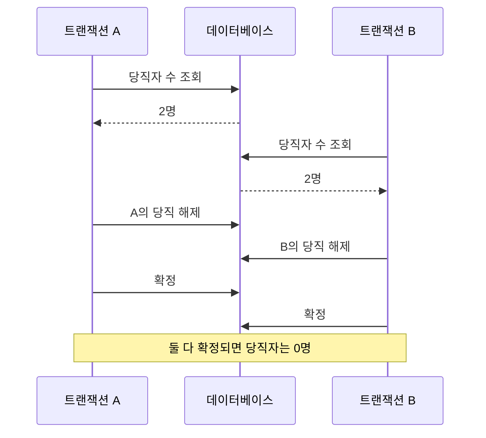

## 이 글에서 다루는 것

**요약** 여러 변경을 한꺼번에 확정하는 것과, 동시에 실행되는 작업들이 서로의 판단을 깨뜨리지 않게 하는 것은 다른 문제다. 트랜잭션의 원자성에서 시작해 격리 수준과 직렬화 가능성까지 연결하면, 데이터베이스에 작업을 묶었는데도 업무 규칙이 깨지는 이유를 설명할 수 있다.

- **난이도:** 중급.
- **선수 개념:** SQL의 `SELECT`와 `UPDATE`, 테이블의 행, 여러 요청이 동시에 실행될 수 있다는 사실.
- **범위:** 트랜잭션의 원자성, 격리 수준, 직렬화 가능성이라는 세 개념.
- **읽고 나면 할 수 있는 것:** 부분 반영과 동시 실행 오류를 구분하고, 업무 규칙에 맞는 격리 수준과 재시도 범위를 판단할 수 있다.
- **조사일:** 2026-10-01.
- **조사 기간:** 2026-10-01 당일. 시사 동향이 아닌 정의와 동작을 공식 문서에서 확인했다.

구체적인 데이터베이스 동작은 **PostgreSQL 17** 기준이다. **확인된 사실**은 직접 연 공식 문서에 근거하고, **가정 예시**와 **설계 판단**은 이를 적용한 설명이다. 예제 실행과 게시용 자동 검사는 수행하지 않았다.

## 용어 정리

**요약** 원자성은 변경의 반영 단위를, 격리 수준은 동시 실행 사이의 관찰 규칙을, 직렬화 가능성은 허용되는 실행 결과를 설명한다.

| 용어 | 영문·별칭 | 한 줄 정의 |
|---|---|---|
| 트랜잭션 | transaction | 데이터베이스에서 여러 작업을 하나의 확정 또는 취소 단위로 묶는 실행 단위다. |
| 원자성 | atomicity | 트랜잭션의 변경이 일부만 확정되지 않고 전체 반영 또는 전체 취소되는 성질이다. |
| 격리 수준 | isolation level | 동시에 실행되는 트랜잭션 사이에서 허용할 데이터 관찰과 실행 이상을 정하는 보장 수준이다. |
| 스냅샷 | snapshot | 데이터베이스를 읽을 때 어떤 변경을 볼 수 있는지 정하는 일관된 데이터 관점이다. |
| 직렬화 가능성 | serializability | 동시에 실행한 트랜잭션들의 효과가 어떤 순서로 하나씩 실행한 효과와 같아지는 성질이다. |
| 직렬화 실패 | serialization failure | 데이터베이스가 격리 보장을 지키기 위해 트랜잭션을 중단하고 재실행을 요구하는 오류다. |

정의 근거는 PostgreSQL의 [트랜잭션 설명](https://www.postgresql.org/docs/17/tutorial-transactions.html), [동시성 제어 소개](https://www.postgresql.org/docs/17/mvcc-intro.html), [격리 수준](https://www.postgresql.org/docs/17/transaction-iso.html), [직렬화 실패 처리](https://www.postgresql.org/docs/17/mvcc-serialization-failure-handling.html) 문서다.

## 트랜잭션과 원자성: 부분 반영을 막는 경계

**요약** 원자성은 함께 성공해야 하는 변경을 한 단위로 묶는다. 다만 어떤 변경이 성공으로 인정되어야 하는지는 애플리케이션이 정확히 표현해야 한다.

**왜 생겼는가.** 주문을 접수하면서 재고를 줄이고 주문 행을 저장한다고 하자. 재고만 줄어든 채 주문 저장이 실패하면 두 데이터가 어긋난다. 각 SQL 문이 올바르더라도, 업무를 구성하는 여러 문장 사이에서 실패할 수 있다.

**어떻게 동작하는가.** PostgreSQL에서는 `BEGIN`으로 작업을 묶고 `COMMIT`으로 확정하거나 `ROLLBACK`으로 취소한다. 다른 트랜잭션에는 확정 전 변경이 보이지 않는다. 다음은 두 행의 존재가 보장된다는 가정 아래, 묶음의 경계만 보여 주는 PostgreSQL용 SQL이다.

```sql
BEGIN;
UPDATE counters SET value = value - 1 WHERE id = 1;
UPDATE counters SET value = value + 1 WHERE id = 2;
COMMIT;
```

**확인된 사실.** PostgreSQL은 명시적인 `BEGIN`이 없는 SQL 문도 트랜잭션 안에서 실행한다. 따라서 여러 문장을 따로 보내는 것과 하나의 트랜잭션으로 묶는 것은 다르다. 클라이언트 라이브러리가 경계를 자동으로 관리할 수도 있다. [공식 트랜잭션 설명](https://www.postgresql.org/docs/17/tutorial-transactions.html)

**무엇을 얻고 무엇을 잃는가.** 부분 반영을 막지만 성공 조건을 자동으로 알아내지는 못한다. 예를 들어 대상 행이 없어서 변경 건수가 0인 상황을 업무 실패로 볼지는 별도 판단이다.

**설계 판단.** 트랜잭션 경계는 함께 유지해야 할 업무 규칙에서 정한다. 위 예제를 실제 기능으로 옮긴다면 대상 존재 여부와 허용 값도 확인해야 한다. 단지 `BEGIN`과 `COMMIT`을 붙였다는 이유로 기능이 올바르다고 판단해서는 안 된다.

## 격리 수준: 같은 작업 안에서도 읽는 값이 달라지는 이유

**요약** 트랜잭션 안에 있다는 사실만으로 읽은 값이 끝까지 고정되지는 않는다. 어떤 시점의 변경을 관찰하는지는 격리 수준과 데이터베이스 구현에 달려 있다.

**왜 생겼는가.** 다른 요청이 데이터를 바꾸는 동안 보고서를 읽거나 변경 여부를 결정해야 한다. 매번 최신 확정 값을 보는 것과, 여러 번 읽어도 같은 관점을 유지하는 것은 서로 다른 요구다.

**어떻게 동작하는가.** PostgreSQL은 여러 데이터 버전을 이용하는 MVCC 방식으로 읽기에 스냅샷을 제공한다. 데이터 파일 전체를 요청마다 복사한다는 뜻이 아니라, 읽을 수 있는 버전을 구분한다는 뜻이다. 일반적인 조회와 변경 사이의 경합을 줄이는 것이 이 방식의 이점이다. [공식 동시성 제어 소개](https://www.postgresql.org/docs/17/mvcc-intro.html)

**확인된 사실.** PostgreSQL 17의 일반 `SELECT`를 기준으로 비교하면 다음과 같다. 두 수준 모두 자기 트랜잭션이 앞서 수행한 변경은 볼 수 있다.

| 격리 수준 | 다른 트랜잭션의 변경을 보는 기준 | 같은 조회를 반복할 때 |
|---|---|---|
| Read Committed | 각 문장 시작 전 확정된 변경 | 중간에 확정된 변경이 보일 수 있다. |
| Repeatable Read | 첫 비트랜잭션 제어 문장 시작 시점의 스냅샷 | 이후 다른 트랜잭션이 확정한 변경은 보이지 않는다. |

PostgreSQL의 기본값은 Read Committed다. 이 비교를 다른 데이터베이스의 같은 이름에 그대로 적용해서는 안 된다. [공식 격리 수준 설명](https://www.postgresql.org/docs/17/transaction-iso.html)

**가정 예시.** 한 트랜잭션이 상품 가격을 두 번 조회하는 사이에 다른 트랜잭션이 가격을 바꾸고 확정한다. Read Committed에서는 두 조회가 다른 값을 볼 수 있다. Repeatable Read에서는 첫 조회가 정한 관점을 유지한다.

**무엇을 얻고 무엇을 잃는가.** 문장마다 관점을 갱신하면 더 최근의 확정 변경을 반영할 수 있다. 고정된 관점은 여러 조회를 비교하기 편하지만 이후 변경을 반영하지 않는다.

**설계 판단.** 여러 조회로 만드는 보고서에는 관점의 일관성이 중요할 수 있다. 반면 화면에서 본 값이 이후 변경 작업까지 유효하다고 가정하는 것은 별도 문제다. 읽은 값의 안정성과 그 값에 근거한 변경의 안전성을 구분해야 한다.

## 직렬화 가능성: 안정적으로 읽어도 판단이 충돌할 수 있다

**요약** 각 트랜잭션이 안정적인 데이터를 읽어도, 서로의 판단이 겹치면 전체 규칙이 깨질 수 있다. 직렬화 가능성은 확정된 결과를 하나씩 실행한 결과로 설명할 수 있게 한다.

**왜 생겼는가.** 당직자가 최소 한 명은 남아야 한다고 하자. 처음에는 A와 B가 모두 당직 중이다. 각자의 당직 해제 요청은 당직자가 두 명 이상이면 자기 행을 해제한다.

**가정 예시.** 두 트랜잭션이 같은 초기 상태를 읽고 서로 다른 행을 수정하면 다음 실행이 가능하다.



이 결과가 왜 문제인지는 실행 순서를 바꿔 보면 드러난다. A가 먼저 끝났다면 B는 한 명만 남았음을 확인하고 해제하지 않아야 한다. B가 먼저 끝나도 마찬가지다. 둘 다 해제된 결과는 어느 순서로 하나씩 실행해도 나오지 않는다.

**어떻게 동작하는가.** PostgreSQL 17의 Serializable은 읽기와 쓰기의 의존 관계를 감시하고, 직렬 실행으로 설명할 수 없는 결과를 막기 위해 트랜잭션을 실패시킬 수 있다. 실제 작업을 모두 한 줄로 세워 실행하는 방식은 아니다. Repeatable Read의 안정적인 스냅샷만으로는 이 보장이 성립하지 않는다. [공식 Serializable 설명](https://www.postgresql.org/docs/17/transaction-iso.html#XACT-SERIALIZABLE)

**무엇을 얻고 무엇을 잃는가.** 관련 작업을 Serializable로 일관되게 실행하면 업무 규칙을 순차 실행 기준으로 검토하기 쉬워진다. 대신 의존 관계 감시와 실패한 작업의 재실행 비용이 든다. 잘못 작성된 순차 로직 자체를 고쳐 주지는 않는다.

**확인된 사실.** PostgreSQL의 직렬화 실패 코드는 `40001`이다. 재시도할 때는 마지막 SQL만이 아니라 SQL과 값을 결정한 로직까지 포함한 트랜잭션 전체를 다시 실행해야 한다. 반복 실행이 반드시 곧 성공한다는 보장도 없다. [공식 직렬화 실패 처리](https://www.postgresql.org/docs/17/mvcc-serialization-failure-handling.html)

**설계 판단.** 당직 예제에서는 재시도 시 인원수를 다시 조회해야 한다. 이전에 읽은 두 명이라는 판단을 재사용하면 재시도의 목적이 사라진다.

## 흔한 오해

**요약** 변경을 묶는 보장, 읽기를 안정화하는 보장, 동시 실행 결과를 제한하는 보장을 구별해야 한다.

| 흔한 설명 | 실제 | 왜 갈리는가 |
|---|---|---|
| 트랜잭션으로 묶으면 업무 규칙은 안전하다. | 원자적으로 확정한 작업도 다른 작업과 함께 실행되면 규칙을 깰 수 있다. | 부분 반영과 동시 판단 충돌을 같은 문제로 보기 때문이다. |
| 같은 값을 계속 읽으면 동시 실행도 안전하다. | 당직 예제처럼 안정된 관점에서 서로 다른 행을 바꿔도 전체 결과가 잘못될 수 있다. | 읽기의 안정성과 변경 결과의 정합성을 혼동하기 때문이다. |
| Serializable은 실제로 하나씩 실행한다. | PostgreSQL은 동시 실행을 허용하면서 일부 작업을 실패시켜 보장을 지킨다. | 결과에 대한 보장을 실행 방식에 대한 설명으로 받아들이기 때문이다. |

위 구분의 근거는 PostgreSQL의 [트랜잭션](https://www.postgresql.org/docs/17/tutorial-transactions.html) 및 [격리 수준](https://www.postgresql.org/docs/17/transaction-iso.html) 문서다.

## 면접에서 자주 묻는 것

**요약** 수준 이름을 외우기보다, 어떤 실패를 막는지와 실패 후 무엇을 다시 실행해야 하는지 설명하는 것이 중요하다.

1. **원자성과 격리 수준은 어떤 차이가 있는가?**  
   원자성은 한 작업의 변경이 일부만 확정되는 문제를 다룬다. 격리 수준은 동시에 실행되는 작업 사이에 어떤 관찰과 결과를 허용하는지 다룬다.

2. **PostgreSQL의 Repeatable Read만으로 당직 예제를 안전하게 만들 수 있는가?**  
   충분하지 않다. 두 작업이 같은 초기 상태를 읽고 다른 행을 수정하면, 각자의 읽기는 안정적이어도 전체 규칙이 깨질 수 있다.

3. **직렬화 가능성을 어떻게 확인해 설명할 수 있는가?**  
   동시 실행의 효과가 어떤 순서의 순차 실행 효과와 같은지 따진다. 당직자가 모두 사라지는 예제는 어느 순차 실행으로도 설명되지 않는다.

4. **직렬화 실패 후 마지막 `UPDATE`만 다시 실행하면 되는가?**  
   아니다. 새 트랜잭션에서 조회와 조건 판단까지 다시 수행해야 한다. PostgreSQL 공식 문서는 SQL 선택과 값 결정 로직을 포함한 전체 재시도를 요구한다. [실패 처리 문서](https://www.postgresql.org/docs/17/mvcc-serialization-failure-handling.html)

## 개발자가 알아둘 것

**요약** 먼저 지켜야 할 규칙을 문장으로 쓰고, 그 규칙을 판단하는 조회와 변경을 함께 설계해야 한다. 재시도 역시 정상적인 실행 경로의 일부다.

**설계 판단.** 다음 순서로 검토하면 누락을 줄일 수 있다.

1. **규칙을 구체화한다.** 당직자는 최소 한 명이라는 표현처럼 성공 후 반드시 참이어야 할 조건을 적는다.
2. **모든 변경 경로를 찾는다.** 일반 API뿐 아니라 관리 기능과 배치도 같은 규칙을 지켜야 한다.
3. **판단의 근거를 확인한다.** 한 행만 보면 되는지, 여러 행을 조회해야 하는지 구분한다.
4. **경쟁 상황을 검증한다.** 당직 예제라면 두 세션이 모두 조회를 마친 뒤 각각 변경하도록 실행을 조율하고, 확정 결과와 재시도 결과를 검사한다.
5. **재시도 비용을 관찰한다.** 성공률뿐 아니라 시도 횟수와 최종 응답 시간도 확인한다.

**확인된 사실.** 데이터베이스 제약 조건으로 표현할 수 있는 규칙은 해당 기능을 활용할 수 있다. 다만 PostgreSQL의 `CHECK`는 다른 행의 데이터를 참조하는 조건을 지속적으로 보장하는 수단이 아니다. 따라서 당직자 전체 수 조건을 단순한 행별 `CHECK`처럼 취급해서는 안 된다. [공식 제약 조건 설명](https://www.postgresql.org/docs/17/ddl-constraints.html)

**설계 판단.** 재시도 구간에서 이메일 전송이나 외부 결제 호출까지 반복하면 부수 효과가 중복될 수 있다. 데이터베이스 작업의 재실행 범위와 외부 작업의 실행 시점을 함께 검토해야 한다. 구체적인 외부 시스템 연동 방식은 이 글의 범위에서 제외한다.

## 더 읽을 거리

**요약** 트랜잭션 경계, 읽기 관점, 실패 처리 순서로 공식 문서를 읽으면 개념을 실제 코드에 연결하기 쉽다. 아래 자료는 모두 PostgreSQL 17 공식 문서이며 확인일은 2026-10-01이다.

- [Transactions](https://www.postgresql.org/docs/17/tutorial-transactions.html) — 작업 묶음, 확정과 취소, 클라이언트의 트랜잭션 관리.
- [Introduction to Concurrency Control](https://www.postgresql.org/docs/17/mvcc-intro.html) — MVCC와 스냅샷에 기반한 읽기.
- [Transaction Isolation](https://www.postgresql.org/docs/17/transaction-iso.html) — 격리 수준별 관찰 규칙과 Serializable의 보장.
- [Serialization Failure Handling](https://www.postgresql.org/docs/17/mvcc-serialization-failure-handling.html) — 오류 코드와 전체 트랜잭션 재시도의 필요성.
- [Constraints](https://www.postgresql.org/docs/17/ddl-constraints.html) — 데이터 규칙을 선언하는 방법과 `CHECK`의 범위.
